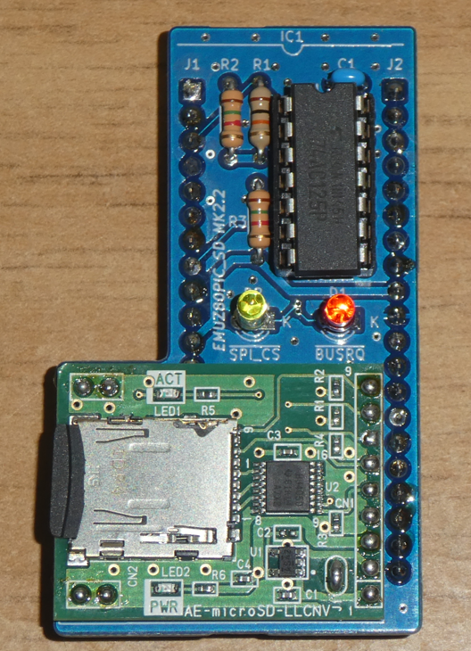
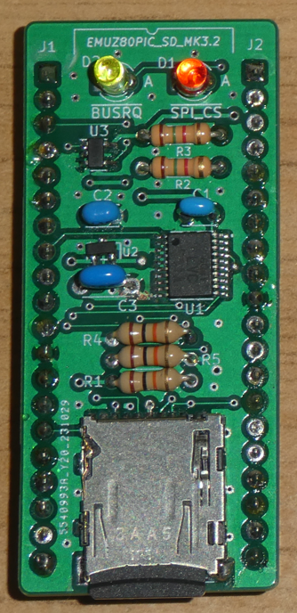

# EMUZ80PIC_SD MK2.2, MK3.2
 
EMUZ80PIC_SDは、EMUZ80にアドオンするμSDカードモジュールです。 
今回、新たに2種類のμSDカードモジュールを作ってみました。 
 
 
 

 
 
第一弾に比べて、LEDの数を増やしました。 
PICがバスを占有していることを示す/BUSRQの信号でＬチカします。 
/SPI_CSの信号と微妙に違うタイミングでLチカすることを楽しめます。(笑) 
とは言っても、SDカードアクセス時には両方ほぼ同時にLチカしますが(;'∀') 
 
 
今回公開するのは、ガーバーデータと図面、部品表となります。 
 
第一弾のEMUZ80PIC_SDは、以下を参照してください。ファームウェアもそこにあります。 
https://github.com/akih-san/EMUZ80PIC_SD 
 
 
このμSDカードモジュールは、EMUZ80+SuperMEZ80、または、EMUZ80+MEZZ180RAMの組み合わせで、 
CP/M-80 Ver2.2を走らせることが出来ます。 
 
EMUZ80は、電脳伝説(@vintagechips)さんによって作成された2チップで動作するシンプルなSBCです。 
SuperMEZ80、MEZZ180RAMは、@S_Okueさんによって作成されたEMUZ80用のメザニンボードです。 
 
EMUZ80、SuperMEZ80、MEZZ180RAMは、オレンジピコショップでお求めになれます。 
https://store.shopping.yahoo.co.jp/orangepicoshop/ 
 
# EMUZ80PIC_SD MK2.2
秋月電子通商で販売されている、μSDカードスロットレベルシフタ付きブレークアウト基板キット 
(AE-microSD-LLCNV)を採用しています。2.54mm間隔のDIP用基板なので、ハンダ付けの作業も楽です。 
第一弾のμSDカードモジュールはμSDカードをコネクタで接続していましたが、MK2.2ではハンダ付け 
されるので、安定した固定感を得られます。 
作成上の注意点がありますので、「EMUZ80PIC_SD MK2.2作成上の注意点.pdf」を参照の後に作成を 
してください。 
 
 

 
 
# EMUZ80PIC_SD MK3.2
 
EMUZ80PIC_SD MK3.2は、SMD部品を使い、μSDカードを基板に直接取り付ける事で、第一弾の 
EMUZ80PIC_SDと同じ面積に全ての部品を実装しています。 
一番コンパクトな仕上がりとなっています。 
ただし、チップ抵抗等は敢えて使わず、カラーコードの抵抗等を使用してレトロ感？を出してみました。 
カラー抵抗の色どりが、味わい深いと思います(^^♪ 
 
ただし、SMDなだけに、ハンダ付けの難易度が上がります。HD74LVC541ATELLは0.65mmピッチなので 
リフロー出来る方は、リフローした方が確実です。 
ハンダに自身の無い方は、EMUZ80PIC_SD MK2.2を選択した方が無難かと思います。 
 
 

 
 
＜参考＞ 
・EMUZ80 
EUMZ80はZ80CPUとPIC18F47Q43のDIP40ピンIC2つで構成されるシンプルなコンピュータです。 
 
＜電脳伝説 - EMUZ80が完成＞   
https://vintagechips.wordpress.com/2022/03/05/emuz80_reference   
＜EMUZ80専用プリント基板 - オレンジピコショップ＞   
https://store.shopping.yahoo.co.jp/orangepicoshop/pico-a-051.html 
 
・SuperMEZ80 
SuperMEZ80は、EMUZ80にSRAMを追加し、Z80をノーウェイトで動かすことができるメザニンボードです 
 
SuperMEZ80 
https://github.com/satoshiokue/MEZ80RAM 
https://github.com/satoshiokue/SuperMEZ80 
 
・MEZZ180RAM 
MEZZ180RAMは、EMUZ80にZ180+SRAMのメザニンボードです。HD64180R/ZやZ8S180が動作します。 
 
MEZZ180RAM 
https://github.com/satoshiokue/MEZZ180RAM 
https://github.com/satoshiokue/EMUZ80-Z180RAM 
